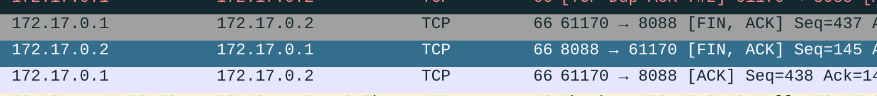
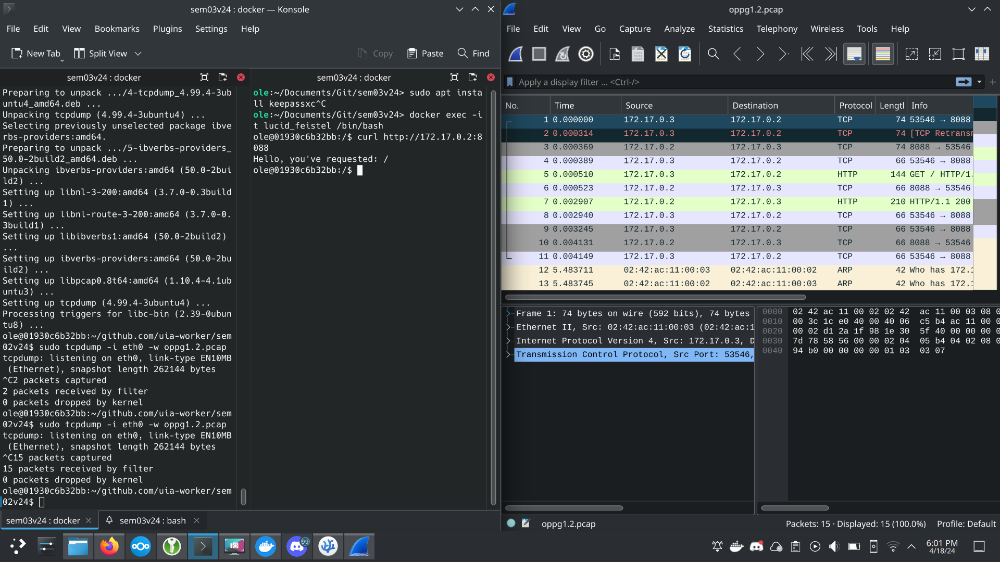

# 1 Dockerfil

Repository https://github.com/cataclym/sem02v24

### Docker Images etter versjon2

### Docker programvare versjoner

### Bevise at mappen er koblet sammen på kontainer og vertsmaskin

# 2 Process virtualisering av CPU

1.  Terminal på vertsmaskin har brukernavn @ localhost
                                                                
        ole@localhost
    
    Terminal i kontaineren har brukernavn @ kontainer-ID
                                    
        ole@a504c8b43e29

2.  Oppstart av flere terminaler til samme kontainer skjer ved å bruke:

        docker exec -it minubuntu /bin/bash

3.  
    (Docker-desktop er ikke tilgjengelig for distroen min)

    ### ps aux
    

    ### Jobs
    

    ### kill -9 $(pidof cpu)
    

# 3

1.
    ### ./stackoverflow 
    

2. 
    ### strace -c ./stackoverflow
    

    ### strace -c ./a.out
    

    ### valgrind --leak-check=yes ./a.out
    
# 4

    tail og head leser av første og siste linjen av en fil.

* ## C
    
    

* ## Rust

    

* ## Java

    

* ## Go

    

* ## Python

    

* ## C#

    

### Systemkall

| Språk   | C      | Rust   | Java   | Go     | Python | C#     | 
| ------  | ------ | ------ | ------ | ------ | ------ | ------ |
|time real|0m0.257s|0m0.012s|0m0.519s|0m0.004s|0m0.025s|0m0.032s|
|time user|0m0.170s|0m0.011s|0m1.208s|0m0.000s|0m0.017s|0m0.012s|
|time sys |0m0.081s|0m0.000s|0m0.070s|0m0.004s|0m0.009s|0m0.020s|
|read     |313     |7       |9       |3       |22      |28      |
|write    |313     |2       |0       |2       |2       |3       |
|openat   |4       |6       |19      |3       |8       |55      |
|mmap     |8       |14      |36      |21      |29      |98      |
|getdent64|0       |0       |0       |0       |14      |11      |
|brk      |3       |3       |4       |0       |8       |14      |

#### strace kommando:

    strace -c ./c/reverse && \
        strace -c ./rust/reverse-rust && \
        strace -c java ./java/ReverseBytesOfFile.java && \
        strace -c ./go/reverse && \
        strace -c python3 ./python/reverse-python.py && \
        strace -c mono ./csharp/reverse-bytes-of-file.exe

