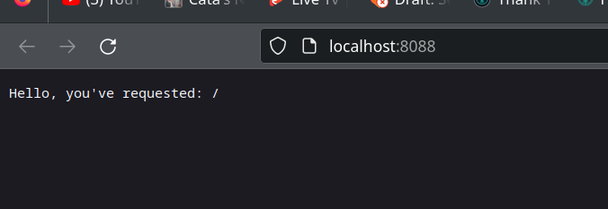
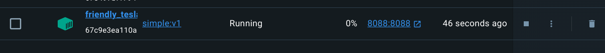
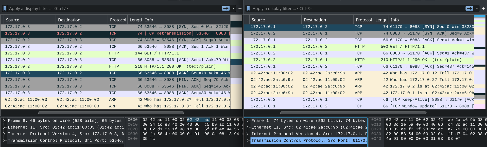
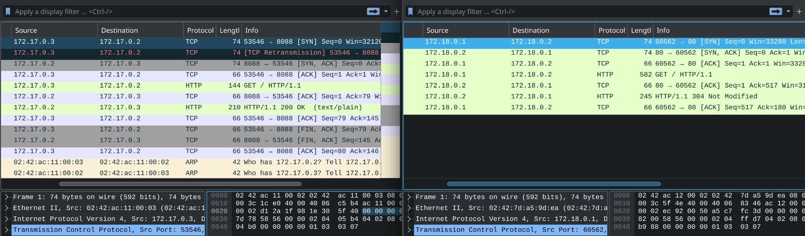
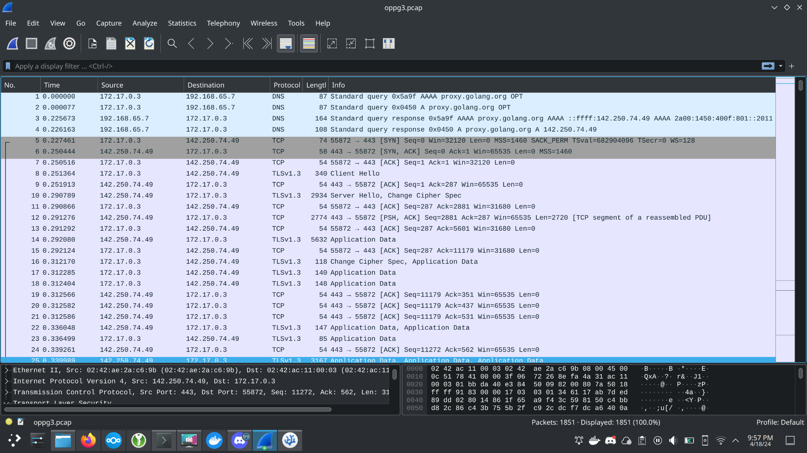

### Oppgave 1.1

a) 

b) 

c)
1. ### Protokoller 
    HTTP og TCP protokoller

2. ### 3-veis-hilsen TCP 
    - Klienten sender først en SYN segment (Synchronize Sequence Number) for å etablere en kobling til serveren.
    - Deretter svarer serveren med et (SYN + ACK) segment for å anerkjenne klienten.
    - Til slutt svarer klienten med å anerkjenne svaret til klienten og deretter etablere en stabil forbindelse mellom klient og server.

    
    (SYN - SYN+ACK - SCK)

3. ### Avslutning av TCP sesjon
    - Klient sender et FIN segment for å fortelle serveren at den ønsker å avslutte forbindelsen.
    - Server svarer med FIN og ACK for å anerkjenne.
    - Klient svarer med ACK, og avslutter forbindelsen.
    

### Oppgave 1.2

a) 

b) 

c) 
Her er det flere likheter, fra 3-veis-hilsen til FIN avslutning. Forskjellen er flere `keep-alive` TCP forespørsler i nettleseren.

--- 

### Oppgave 2.1

a) 

b) 
(1.2, 2.1)

### Oppgave 2.2

a) Man kan bruke `docker container commit ex02-wordpress-1` for å ta vare på forandringer.

b) I denne fangsten kan man se at serveren kommuniserer med databasen (MySQL)

---

### Oppgave 3

TLS blir brukt av HTTPS for kryptering. 
TLS pakkene har hilsninger i protokollene.
 Man ser ikke hva som blir servert over https.

TCP pakkene viser både kilde-port og destinasjons-port. Man kan også se hvilke flag (ACK) den sender.

De andre pakkene i fangsten er DNS for å løse nettaddressen til en IP adress. 